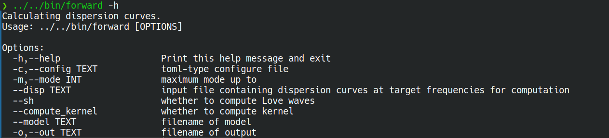
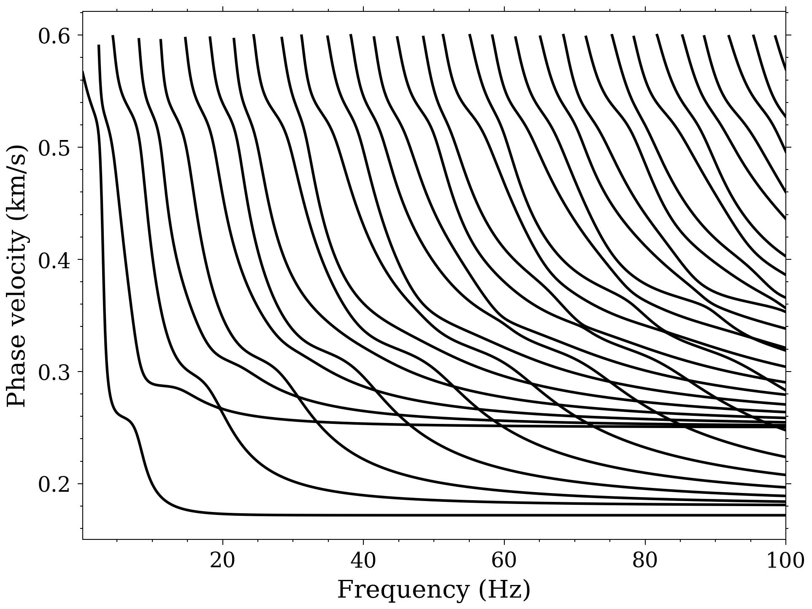
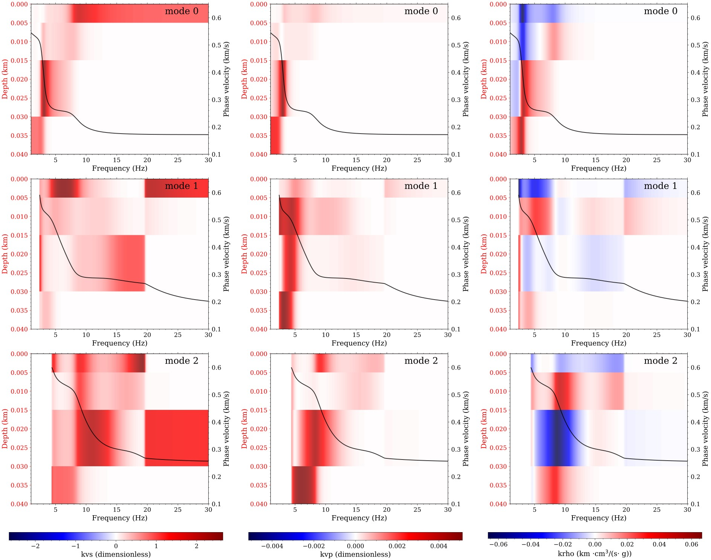

# Demo

To facilitate users in quickly understanding and utilizing the code, three examples are provided
below, each demonstrating the application of the framework in different scenarios based on the
content of the manuscript.

## Example 1: [Model 1](../demo/lvl-l4) (Four-Layer Model with a Low-Velocity Layer)

Model 1 is a four-layer numerical model designed to address the ``mode-kissing'' phenomenon, where adjacent dispersion curve branches converge closely in media containing low-velocity layers (LVLs). This model, with parameters detailed in Table 1, helps illustrate the limitations of conventional root-finding methods in detecting critical roots at mode-kissing zones. By applying the proposed quadratic extrema interpolation method, supplementary sampling points are strategically added based on the dispersion function’s morphology, resolving previously missed roots and ensuring complete dispersion curve computation. This example highlights the method’s efficiency in handling LVL-induced complexities, which is crucial for accurate subsequent inversion.

## Example 2: [Near-Surface Numerical Inversion](../demo/syn-nearsurface/)

This near-surface example uses a five-layer theoretical model (parameters in Table 2) to validate the inversion workflow. Simulated Rayleigh wave data are generated via the CPS package, processed using the Frequency-Bessel (F-J) transform for dispersion energy imaging, and multi-mode dispersion curves are extracted. The inversion employs the L-BFGS-B algorithm with wavelength-constrained layering, focusing on shear-wave velocity (\(V_S\)) optimization. Results show robust recovery of the target model, including accurate resolution of a shallow low-velocity layer (2–6 m depth) and consistent velocity trends. This example demonstrates the framework’s reliability in near-surface applications such as engineering site investigation.

## Example 3: [Crustal LVL and Uppermost Mantle Inversion](../demo/syn-crustmantle/)

This example validates the framework’s performance in deeper structures using a crustal model with a low-velocity layer (LVL), representative of tectonically active regions or rift zones. Theoretical dispersion curves are modified to include mode-dependent noise and frequency constraints, mimicking real-world data. Inversion with 100 randomized initial models (using Brocher’s empirical relationships for \(V_P\) and density) successfully resolves key features, including the crustal LVL and uppermost mantle velocity trends. This example confirms the method’s ability to handle deep subsurface complexities, supporting crustal and lithospheric studies.

# Tutorial

## Forward computation

### Calculating Dispersion Curves

```bash
# Assume your terminal is currently in the demo/lvl-l4 folder.
../../bin/forward -h
```

The help information is shown below



To compute dispersion curves using the provided tool, follow these commands based on your specific needs:

- **Compute fundamental-mode dispersion curves**:  
  Run the forward modeling executable with:

  ```bash
  ../../bin/forward
  ```

  Alternatively, explicitly specify the fundamental mode (mode 0) using:

  ```bash
  ../../bin/forward -m 0
  ```

- **Compute up to the 5th mode**:  
  To include modes from the fundamental up to the 5th order, use the `-m` flag to set the maximum mode:

  ```bash
  ../../bin/forward -m 5
  ```

- **Compute Love wave dispersion curves**:  
  By default, the tool calculates Rayleigh wave dispersion. To switch to Love waves, add the `--sh` flag:

  ```bash
  ../../bin/forward --sh
  ```

- **Custom Model Files**  
  To compute dispersion curves for a specific model, use the `--model` flag followed by your model file path:

  ```bash
  ../../bin/forward --model model_data.txt
  ```

  If no model is specified, the tool will default to the model file configured in `config.toml`.

- **Matching Frequency Sampling to Existing Dispersion Data**  
  To align the frequency sampling of your computed dispersion curves with an existing dispersion file (e.g., for inversion or comparison), use the `--disp` flag:

  ```bash
  ../../bin/forward --disp disp.txt
  ```

  This ensures the output uses the same frequency points as `disp.txt`. Without this flag, frequencies are determined by the default settings in `config.toml`.

- **Computing Sensitivity Kernels**

  The tool supports calculating sensitivity kernels for P-wave velocity (\(V_P\)), S-wave velocity (\(V_S\)), and density (\(\rho\)). The range of modes and frequencies for kernel computation is determined by the parameters used in the prior dispersion curve calculation.

  To compute sensitivity kernels, add the `--compute_kernel` flag to your command. For example, to calculate kernels corresponding to dispersion curves of modes 0 to 3:

  ```bash
  ../../bin/forward -m 3 --compute_kernel
  ```

  All sensitivity kernel results are saved to a unified output file named `kernel.h5`.

### Visualizing Results with Python Scripts

To visualize the computed dispersion curves, follow these steps using the provided Python script:

1. **First, compute the complete dispersion curves** using the forward modeling tool with a sufficiently high mode order (e.g., up to mode 1000) to capture all relevant modes:

   ```bash
   ../../bin/forward -m 1000
   ```

2. **Generate the dispersion curve plot** by running the `plot_disp.py` script, specifying the output dispersion file (e.g., `disp.txt`):
   ```bash
   ../../python/plot_disp.py disp.txt
   ```
   This will produce a visualization of the dispersion curves, as shown in the figure below.



The `plot_disp.py` script includes additional options for customizing the plot (e.g., scaling, annotations, or comparison). To explore these features, check the help documentation with:

```bash
../../python/plot_disp.py -h
```

Further details on each option are available in the help output, encouraging users to experiment with configurations tailored to their analysis needs.

To examine the computed sensitivity kernels using the Python visualization tool, follow these steps:

1. **First, calculate the sensitivity kernels** for modes 0 to 2 (3 modes total) using the forward modeling tool with the `--compute_kernel` flag:

   ```bash
   ../../bin/forward -m 2 --compute_kernel
   ```

   This generates the `kernel.h5` file containing the kernels for \(V_P\), \(V_S\), and density (\(\rho\)).

2. **Visualize specific kernels** using the `plot_kernel.py` script. Use the `-m` flag to specify the mode, and `--comp` to select the parameter (\(V_S\) is default if not specified):

   - View the \(V_S\) kernel for the fundamental mode (mode 0):

     ```bash
     ../../python/plot_kernel.py kernel.h5 -m 0
     ```

   - View the \(V_S\) kernel for the 1st mode:

     ```bash
     ../../python/plot_kernel.py kernel.h5 -m 1
     ```

   - View the density (\(\rho\)) kernel for the fundamental mode:

     ```bash
     ../../python/plot_kernel.py kernel.h5 -m 0 --comp rho
     ```

   - View the \(V_P\) kernel for the fundamental mode:
     ```bash
     ../../python/plot_kernel.py kernel.h5 -m 0 --comp vp
     ```

3. **Additional visualization options**:

   - Add a colorbar to the kernel plot with `--show_cb`:

     ```bash
     ../../python/plot_kernel.py kernel.h5 -m 0 --show_cb
     ```

   - Overlay the corresponding dispersion curve on the kernel plot using `--plot_disp`:
     ```bash
     ../../python/plot_kernel.py kernel.h5 -m 0 --plot_disp
     ```

The `plot_kernel.py` script includes further customization features not covered here. To explore the full range of options (such as scaling adjustments or plot styling), refer to the built-in help documentation:

```bash
../../python/plot_kernel.py -h
```

This allows users to tailor visualizations to their specific analytical requirements through self-guided exploration.

By adjusting the calculation frequencies and modifying the parameters of the plotting script,
We can combine these elements to generate a figure as shown below.


