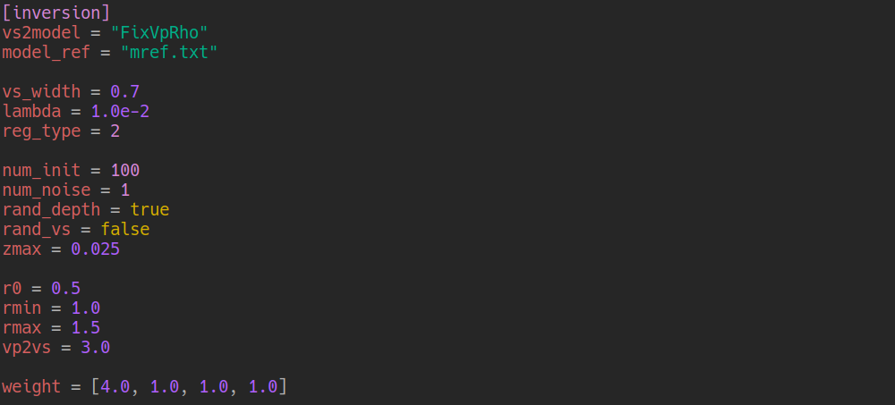
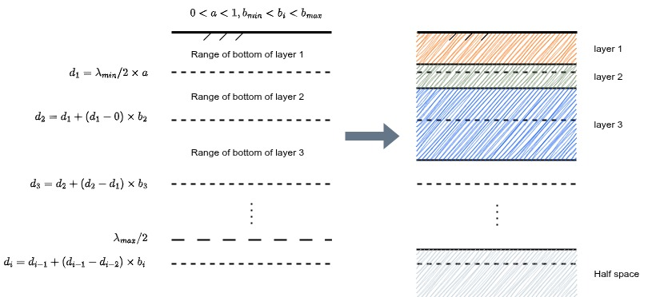
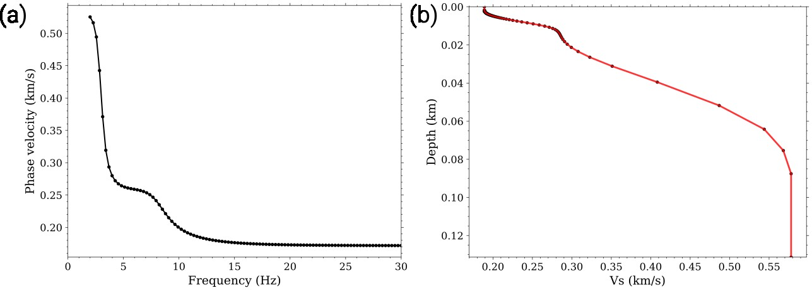
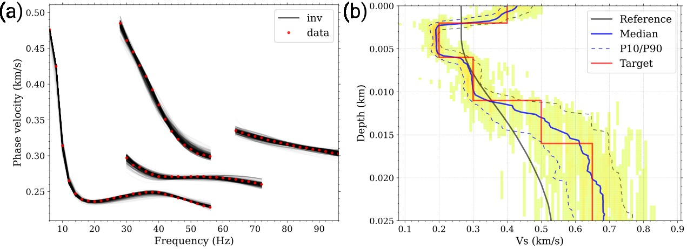
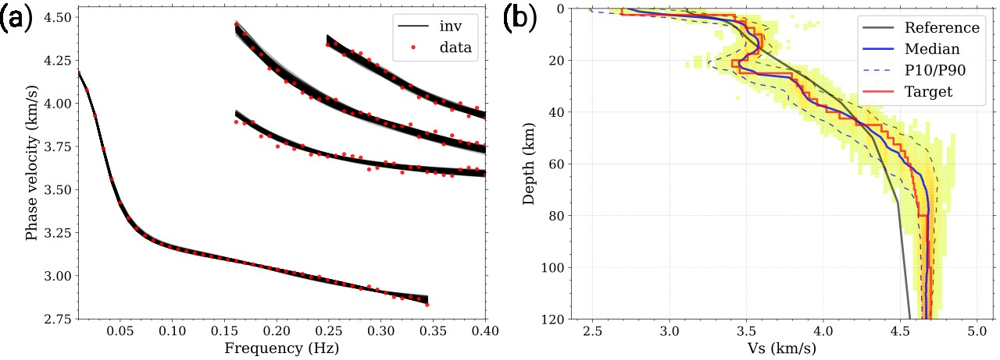

## Tutorial for Inversion

### Understanding the Configuration File (`config.toml`)

The inversion workflow is guided by a configuration file named config.toml, which centralizes key parameters to streamline the inversion process. Below is an explanation of its core sections and settings, as illustrated in the example configuration (refer to the figure for visual reference):



By adjusting `config.toml`, users can tailor the inversion to their specific dataset (e.g., near-surface vs. crustal scales) and balance computational efficiency with solution robustness.

The `[inversion]` block in `config.toml` (as shown in the figure) contains critical parameters that govern the inversion’s mathematical and statistical behavior. Here’s a breakdown of each setting:

1. **Model Conversion (`vs2model`)**

   - `vs2model = "fixvprho"`: Specifies how shear-wave velocity ($V_S$) is converted to other parameters (e.g., $V_P$ and density). Further Explanation of `vs2model` is [here](./vs2model.md).
   - **Supported Modes**:
     - `fixvprho`: Fixes $V_P$ and density to values from the reference model (`model_ref`), useful when these parameters are well-constrained.
     - `nearsurface`: Optimized for shallow models (meters to hundreds of meters), requiring the `vp2vs` parameter to define $V_P/V_S$ ratios.
     - `gardner`: Applies Gardner’s relation for deeper models (kilometers), where density is derived from $V_P$ ($\rho = 0.31 V_P^{0.25}$).
     - `brocher05`: Uses Brocher’s (2005) empirical relations for crustal to upper-mantle models (tens of kilometers), linking $V_P$, $V_S$, and density.

2. **Reference Model (`model_ref`)**

   - `model_ref = "mref.txt"`: Path to a text file containing a starting/reference model (e.g., a 1D layered model with depth, $V_S$, $V_P$, and density). This guides the inversion toward geologically reasonable solutions.

3. **Velocity Uncertainty (`vs_width`)**

   - `vs_width = 0.7`: Defines the allowable range for updating $V_S$ during inversion, calculated as $[V_{S,\text{ref}} - v_{\text{width}}/2, V_{S,\text{ref}} + v_{\text{width}}/2]$. Here, $V\_{S,\text{ref}}$ is the shear-wave velocity from the reference model (`model_ref`), linearly interpolated to match the depth nodes of the current initial model. This parameter restricts $V_S$ adjustments to a geophysically plausible range, preventing unrealistic deviations from the reference.

4. **Regularization Strength (`lambda`)**

   - `lambda = 1.0e-2`: Controls the tradeoff between data fit and model smoothness. Smaller values prioritize fitting data (risk of overfitting), while larger values enforce smoother models.

5. **Regularization Type (`reg_type`)**

   - `reg_type = 2`: Specifies the type of regularization (e.g., 1 = first-order Tikhonov regularization, 2 = An's (2020) adaptive first-order Tikhonov regularization), which penalizes rapid changes in model parameters.

6. **Initial Model Exploration (`num_init`, `num_noise`)**

   - `num_init = 100`: Number of randomized initial models to explore, reducing dependence on the starting model.
   - `num_noise = 1`: Number of noise realizations added to data for uncertainty analysis.

7. **Randomization (`rand_depth`, `rand_vs`)**

   - `rand_depth = true`: Enables random variation of layer depths in initial models.
   - `rand_vs = false`: Disables random variation of $V_S$ in initial models (useful if $V_S$ is well-constrained).

8. **Depth Constraints (`zmax`)**

   - `zmax = 0.025`: Serves as the lower bound for depth statistics in the inversion results. The actual inversion depth range is determined by the fundamental-mode dispersion curve (specifically, $\lambda_{\text{max}}/2$, where $\lambda_{\text{max}}$ is the maximum wavelength of the fundamental mode). Since the workflow uses a multi-initial-model inversion (generating multiple solution models), statistics like median, 10th percentile (P10), and 90th percentile (P90) are used to analyze results. `zmax` defines the deepest depth included in these statistical calculations, ensuring consistent depth bounds for comparing model uncertainties.

9. **layering Scaling Bounds (`r0`, `rmin`, `rmax`)**

   - `r0 = 0.5`, `rmin = 1.0`, `rmax = 1.5`: These parameters constrain the scaling factors governing the layering scheme of the inversion model, adapting to surface wave resolution limits:
     - `r0` corresponds to the reference value of `a`, a scaling factor for the shallowest interface ($d_1$). The first layer depth is defined as $d_1 = (\lambda_{\text{min}} / 2) \times a$, where $\lambda\_{\text{min}}$ is the minimum wavelength of the fundamental-mode dispersion curve, and `a` is constrained to $0 < a \leq 1$ (with `r0` as a baseline for fine-tuning near-surface resolution).
     - `rmin` and `rmax` bound `b`, the multiplicative factor for deeper layer thicknesses (below $d_2$). Each deeper layer's thickness is the product of the overlying layer’s thickness and a `b` value randomly selected within $(b_{\text{min}}, b_{\text{max}})$, with $b_{\text{min}}$ ensuring thicknesses increase gradually with depth—matching the reduced sensitivity of surface waves to deeper structures.



_Schematic illustration of the layering definition process for surface wave inversion._

10. **Parameter Ratio (`vs2vp`)**

    - `vs2vp = 3.0`: Fixed ratio of $V_S$ to $V_P$ (e.g., $V_P = 3.0 V_S$), simplifying inversion by reducing free parameters.

11. **Data Weights (`weight`)**
    - `weight = [4.0, 1.0, 1.0, 1.0]`: Weights applied to different mode (e.g., fundamental vs. higher modes), prioritizing high-confidence data.

### Preparing Input Files

To run the inversion workflow, three key components are required: the configuration file (`config.toml`), observed data, and a reference model. Below is a detailed guide to preparing the input files beyond `config.toml`:

#### 1. **Observed Dispersion Curve Data**

The primary input data is a text file (e.g., `disp_obs.txt`) containing frequency-phase velocity pairs for the observed surface waves. It follows a strict three-column format:

| Column 1       | Column 2              | Column 3    |
| -------------- | --------------------- | ----------- |
| Frequency (Hz) | Phase velocity (km/s) | Mode number |

**Notes**: Ensure consistency in units (frequency in Hz, velocity in km/s).

#### 2. **Reference Model**

The reference model provides a starting constraint for subsurface structure, guiding the inversion toward geophysically plausible solutions. It is used to interpolate depth-dependent initial values (e.g., $V_S$ at specific depths) via linear interpolation.

##### **Option 1: User-Defined Reference Model**

Users can manually create a text file (e.g., `mref.txt`) with a 1D layered structure. The file typically includes columns for index of layers, depth (km), density (g/cm^3), $V_S$ (km/s) and $V_P$ (km/s), sorted by increasing depth:

| No. | Depth (km) | Density (g/cm^3) | $V_S$ (km/s) | $V_P$ (km/s) |
| --- | ---------- | ---------------- | ------------ | ------------ |
| 1   | 0.0        | 1.8              | 0.3          | 0.6          |
| 2   | 0.5        | 2.2              | 0.8          | 1.6          |
| 3   | 2.0        | 2.7              | 2.5          | 4.5          |

**Example snippet**:

```
1    0.0   1.8    0.3   0.6
2    0.5   2.2    0.8   1.6
3    2.0   2.7    2.5   4.5
```

##### **Option 2: Automatically Generated via `create_reference_model.py`**

For users without a predefined reference model, the tool provides a script to generate one using the fundamental-mode dispersion curve:

```bash
../../python/create_reference_model.py disp_obs.txt -o mref.txt
```

This script infers a plausible 1D model by inverting the fundamental-mode data, leveraging the strong sensitivity of surface waves to shallow $V_S$ structure.



_(a) Fundamental-mode theoretical dispersion curves of Model~1. The black dots represent key data points on the dispersion curve. (b) Initial shear wave velocity derived from phase velocity values. The black dots in this figure correspond to the positions of the black dots in (a) after converting the frequency-phase velocity data to depth-shear wave velocity data. The red line shows the initial shear wave velocity model obtained by linearly interpolating the black dots, which is processed to avoid abrupt velocity jumps.​_

- **Customization options**:
  - **Smoothing**: Add the `-s` flag with a smoothing parameter (e.g., `1.0e-8`) to reduce artificial discontinuities in the generated model. This is critical for dispersion curves that would otherwise produce abrupt high/low-velocity interfaces, which might introduce non-physical layers during inversion:
    ```bash
    ../../python/create_reference_model.py data.txt -s 1.0e-8
    ```
  - **Matching target model's $V_P$ and density**: Use `--dmodel` to enforce that the generated reference model's $V_P$ and density profiles match those of a target model (e.g., `model_data.txt`). This is particularly useful for synthetic data testing when `vs2model = "fixvprho"` in `config.toml`, ensuring consistency between reference and target parameter relationships:
    ```bash
    ../../python/create_reference_model.py data.txt --dmodel model_data.txt
    ```

#### 3. **Linking Reference Model to Inversion**

To incorporate the reference model into the inversion, use one of two methods:

- **Via `config.toml`**: Set the `model_ref` parameter in the `[inversion]` section:

  ```toml
  [inversion]
  model_ref = "mref.txt"  # Path to user-defined or generated reference model
  ```

- **Via command-line flag**: Override the config file by passing the reference model path directly when running the inversion executable:
  ```bash
  ../../bin/inversion -d data.txt --model_ref mref.txt
  ```

By preparing these input files, users ensure the inversion is anchored to observed data and geologically reasonable starting constraints, laying the groundwork for robust subsurface imaging.

### Running the Inversion and Visualizing Results

Once all input files are prepared, you can proceed with the inversion and analyze the outputs using the provided visualization tools. Here’s a step-by-step guide using the `demo/syn-nearsurface` example:

#### 1. **Executing the Inversion**

Run the inversion executable, specifying the observed dispersion data file with the `-d` flag:

```bash
cd demo/syn-nearsurface
../../bin/inversion -d data.txt
```

A progress bar will appear in the terminal, indicating the status of the inversion (e.g., initial model generation, optimization iterations). Once the progress bar completes, the inversion finishes, and results are saved to `inv.h5`—this HDF5 file contains all inverted models, misfit values, and auxiliary data.

#### 2. **Visualizing Results with `plot_inv.py`**

Use the `plot_inv.py` script to explore key outputs from `inv.h5`. Common use cases include:

- **Checking dispersion curve fit**: Overlay the observed data with predicted dispersion curves from the inverted model using `--plot_disp`:

  ```bash
  ../../python/plot_inv.py inv.h5 --plot_disp
  ```

  This helps validate how well the inverted model reproduces the observed surface wave behavior.

- **Viewing the inverted model**: Display the subsurface model (e.g., $V_S$ vs. depth) with `--plot_model`:

  ```bash
  ../../python/plot_inv.py inv.h5 --plot_model
  ```

  The plot includes statistical metrics (median, P10, P90) to illustrate model uncertainty across the ensemble of inverted solutions.

- **Comparing with a target model**: Add the `-d` flag to overlay a reference or "true" model (e.g., `model_data.txt`) for validation (useful in synthetic tests):
  ```bash
  ../../python/plot_inv.py inv.h5 --plot_model -d model_data.txt
  ```

For more customization (e.g., plotting \(V_P\) or density, adjusting depth ranges, or exporting figures), check the script’s help documentation:

```bash
../../python/plot_inv.py -h
```

By following these steps, you can systematically validate the inversion results, assess model uncertainty, and compare solutions with target models.

Through inversion, the following images can be obtained for the two synthetic examples (minor variations may occur).

**Inversion results from `demo/syn-nearsurface`**



**Inversion results from `demo/syn-crustmantle`**



### Extracting Inverted Models with `print_model.py`

After completing the inversion, you may need to extract the inverted model for further analysis (e.g., building 2D profiles or 3D velocity structures). This can be done using the `print_model.py` script, which supports two output formats tailored to different visualization and processing needs. Below is a detailed explanation, paired with the `plot_model.py` script to illustrate the differences:

#### 1. **Linear-Interpreted Model Output**

To output the model with depth-velocity values interpreted as linear segments (i.e., velocities vary linearly between consecutive depth nodes), use the basic command:

```bash
../../python/print_model.py inv.h5 -o mi_linear.txt
```

- **Characteristics**: The generated `mi_linear.txt` file contains depth-velocity pairs where velocity changes linearly between adjacent depth points.
- **Visualization**: To plot this linear-interpreted model, use `plot_model.py` with the `--linear` flag:
  ```bash
  ../../python/plot_model.py mi_linear.txt --linear
  ```

#### 2. **Stepwise Model Output**

To output the model with depth-velocity values interpreted as step functions (i.e., velocity remains constant within each depth interval, changing abruptly at depth nodes), add the `--step` flag:

```bash
../../python/print_model.py inv.h5 --step -o mi_step.txt
```

- **Characteristics**: The generated `mi_step.txt` file defines velocity as constant within each depth layer, with discrete jumps at specified depth boundaries.
- **Visualization**: Plot this stepwise model directly with `plot_model.py` (no additional flags needed):
  ```bash
  ../../python/plot_model.py mi_step.txt
  ```

#### 3. **Key Notes on Output Parameters**

- The shear-wave velocity ($V_S$) in the extracted model is derived from the **median statistic** of the 2D histogram of inversion results along each depth slice, ensuring robustness against outliers.
- Density ($\rho$) and P-wave velocity ($V_P$) in the output are calculated by applying the `vs2model` conversion (specified in `config.toml` during inversion) to the median $V_S$ values. This maintains consistency with the parameter relationships used in the inversion process.

By choosing the appropriate output format, you can seamlessly integrate the inverted model into subsequent workflows, whether for linear interpolation-based processing or stepwise layer-based analysis.

### Why Discrepancies Arise in Dispersion Curve Fitting After Model Extraction

When you use the extracted model (from `print_model.py`) to recalculate dispersion curves (note that dispersion calculations rely on 1D layered models, so the `--step` output is required for forward modeling) and compare them with the original data, you may occasionally find poorer fitting than observed during inversion. This discrepancy stems from two key reasons:

#### 1. **Non-Linearity Between Model Statistics and Dispersion Curves**

The inverted model output by `print_model.py` uses the **median** of the 2D histogram of inversion results along each depth slice as the representative $V_S$ value. However, the relationship between subsurface models and their corresponding dispersion curves is **non-linear**—meaning the median of the models does not correspond to the median of the dispersion curves generated by all inverted models.

- During inversion, the algorithm optimizes to minimize misfit across the entire ensemble of models, leading to good overall dispersion curve fitting.
- When extracting a single median model, this non-linearity can break the direct link between the model statistic and the dispersion curve statistic, resulting in degraded fitting when the median model is used alone.

#### 2. **Conversion Errors in Stepwise Model Output**

By default, the inversion uses 100 depth sampling points to parameterize the model. When outputting a stepwise model (with `--step`), the continuous depth-velocity distribution is discretized into layers with abrupt velocity jumps at specified depths. This conversion introduces small errors:

- The 100 linear depth samples are translated into a stepwise layer structure, which is an approximation of the original continuous model.
- These discretization errors can propagate to the dispersion curve calculation, causing subtle mismatches even if the median model itself is representative.
