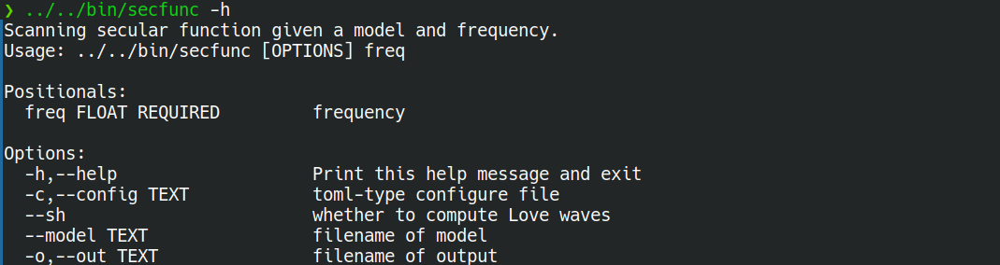
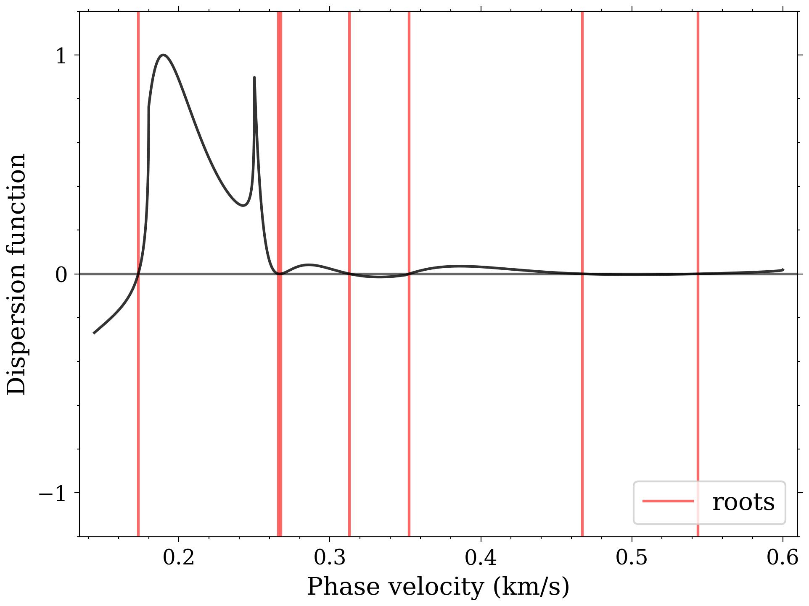
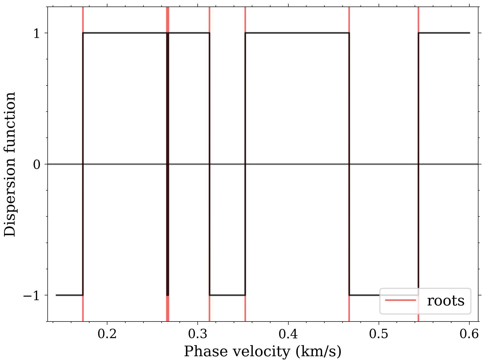
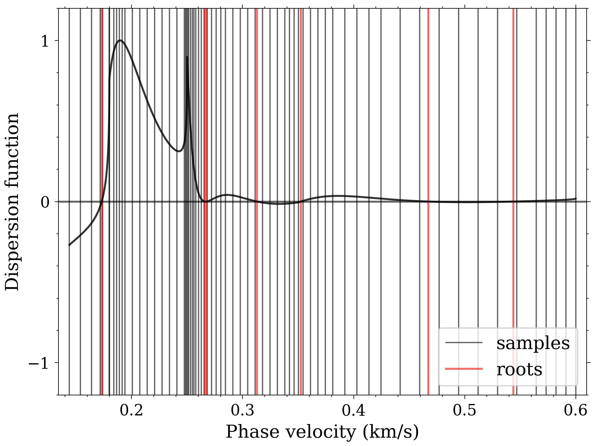
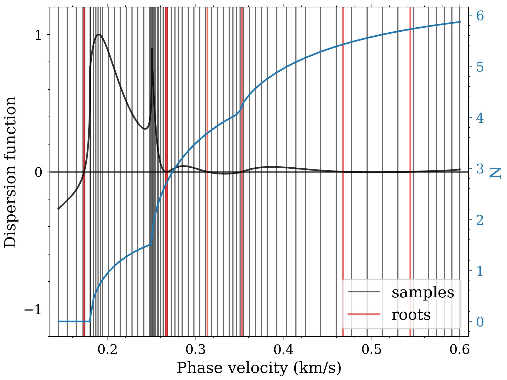
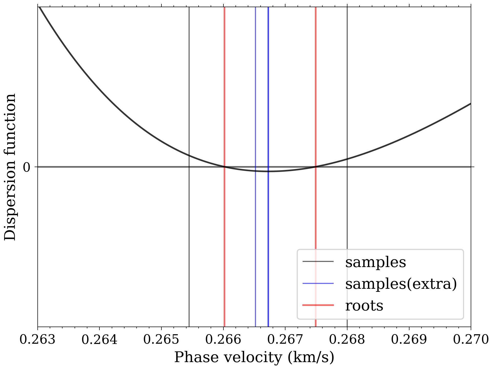

## Tutorial for Secular Function Computation

### The Secular Function (Dispersion Function)

The secular function—often referred to as the dispersion function—has roots that correspond to the phase velocity values of dispersion curves at specific frequencies.

```bash
# Assume your terminal is currently in the demo/lvl-l4 folder.
../../bin/secfunc -h
```

The help information is shown below



To compute this function for a given frequency, use the `secfunc` executable and specify the target frequency. For example, to calculate the dispersion function at 19.7 Hz:

```bash
../../bin/secfunc 19.7
```

This computation generates an output file named `secfunc.h5`, which contains the function data. To visualize the results, use the `plot_secfunc.py` script, which can be run with the generated HDF5 file as input.

### Visualizing the Dispersion Function with `plot_secfunc.py`

After generating `secfunc.h5` using the `secfunc` executable, you can visualize the dispersion function and its key features with the `plot_secfunc.py` script:

- **Basic visualization**: Run the script with the HDF5 file to view the raw dispersion function (black line) and red lines indicating root positions (phase velocities at the specified frequency):

  ```bash
  ../../python/plot_secfunc.py secfunc.h5
  ```



- **Enhanced sign analysis**: Add the `--sign` flag to apply a sign transformation to the dispersion function, making it easier to distinguish positive and negative values:

  ```bash
  ../../python/plot_secfunc.py secfunc.h5 --sign
  ```



- **View initial sampling points**: Use the `--sample` flag to display the automatically generated initial sampling points. Roots are identified by checking sign changes between these points—gaps between sampling points can lead to missed roots:

  ```bash
  ../../python/plot_secfunc.py secfunc.h5 --sample
  ```



- **Visualize N-value variations**: Add the `-N` flag (alongside `--sample`) to display changes in the parameter $N$, which governs the initial sampling strategy:
  ```bash
  ../../python/plot_secfunc.py secfunc.h5 --sample -N
  ```



Initial coarse sampling points $c_j$ are determined by solving $N(c) = j \varepsilon$ ($j=0,1,2,\dots$) over the valid phase velocity range $[c_{min}, c_{max}]$. Here, $\varepsilon$ ($\varepsilon \leq 1$) is a control parameter that adjusts sampling density—smaller values yield finer initial sampling. This visualization clarifies how the spacing of initial points is derived from $N(c)$ variations.

- **Examine supplementary sampling points**: To visualize the supplementary points added by the quadratic extrema interpolation method (used to resolve "mode-kissing" scenarios where roots are closely spaced), combine `--sample` with `--extra`. Use `--xlim` to zoom into a specific velocity range (e.g., 0.263–0.270 km/s) for clarity:
  ```bash
  ../../python/plot_secfunc.py secfunc.h5 --sample --extra --xlim 0.263 0.270
  ```



This reveals how additional points are inserted between closely spaced roots, preventing missed detections in critical regions.
